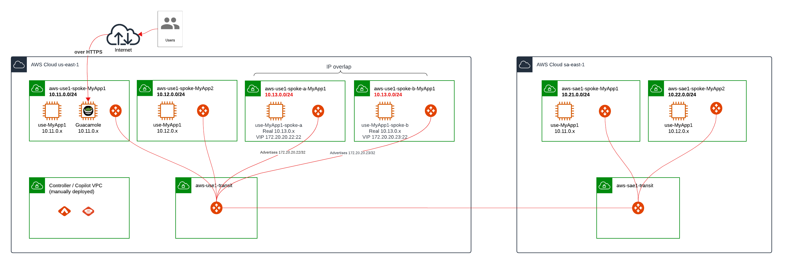

# mpe-poc
All artifacts for PoC

# Context

For that PoC, we need :

- An Aviatrix Controller and Copilot deployed in a dedicated VPC.

- Aviatrix transit deployed in two AWS regions :
  - First transit in North Virinia being us-east-1, named use1 in the code,
  - Second transit in Sao Paulo being sa-east-1, named sae1 in the code,
  - Standard peering between those two regions over AWS backbone.

- Aviatrix spoke deployed in each of the above region :
  - Two VPCs, each with an Aviatrix spoke in first region,
  - Two VPCs with overlaping CIDRs, each with an Aviatrix spoke in first region,
  - Two VPCs, each with an Aviatrix spoke in second region,
  - Each spoke is peered with its regional transit.
  - Each spoke contains a test EC2 instance accessible via Guacamole jumpbox
  - Guacamole server is deployed in the first spoke of the first region. (Search for the URL to connect in the output after terraform deployment)

Diagram of the overall architecture :

# Requirement

- At least one AWS account able to create AWS EC2 identity
- Increase necessary quotas:
  - Elastic IP in Compute (EIP): default is normally 5, push it to 30
  - VPC
- Subscribe to Aviatrix offers :
  - [Aviatrix Secure Cloud Networking (Includes Free Trial)](https://aws.amazon.com/marketplace/pp/prodview-qzvzwigqw72ek?sr=0-4&ref_=beagle&applicationId=AWSMPContessa) 
  - [AWS Marketplace: Aviatrix Secure Networking Platform - BYOL](https://aws.amazon.com/marketplace/pp/prodview-nsys2ingy6m3w?sr=0-3&ref_=beagle&applicationId=AWSMPContessa)
  - [AWS Marketplace: Aviatrix CoPilot](https://aws.amazon.com/marketplace/pp/prodview-hr74smekrfqiu?sr=0-1&ref_=beagle&applicationId=AWSMPContessa)
  
- Follow the doc to deploy controller and copilot
  - [Getting started AWS](https://docs.aviatrix.com/documentation/latest/getting-started/getting-started-guide-aws.html)
- A workstation that:
  - can access to terraform website,
  - can access the newly deployed controller / copilot public IP address,
  - can access github.com to clone this repository,
  - can execute terraform code.
- A terraform.tfvars containing values like in terraform.tfvars.sample
  
# Assumptions

- For fast deploy, we assume PoC is deployed as NON highly available. This can be changed easily by updating terraform code
- We deploy Controller and Copilot is same region as first transit in a dedicated VPC

